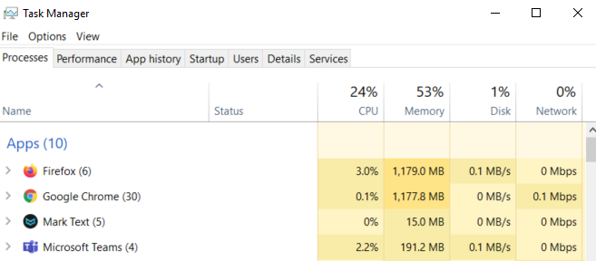

# What is process

A process is an instance allocated in memory when the program is executed. It consists of more than one thread. If you go to `Processes` tab in Windows task manager, you will see processes running and its memory usage.

# What is thread
It is a unit of execution within the process. A unit of CPU utilisation that OS allocates. Each thread has its own stack assigned. Stack is a memory space where you can stores parameters, return address and local variables when a function is called. Having its own stack, it can call a function independently. Also, threads in a process pool share the same address space and resources.

# What is thread pool
When there is a request for creating a thread, OS makes sure there is a memory space for that and assign the memory to thread. Although the thread is created and maintained in the same memory space but there is overhead when creating/collecting a thread. If we create threads beforehand and reuse the threads, we can avoid such expensive costs. A thread pool is a collection of multiple idle threads. These threads will be reused when needed. Once the thread completes its task, it returns to a queue in the pool.