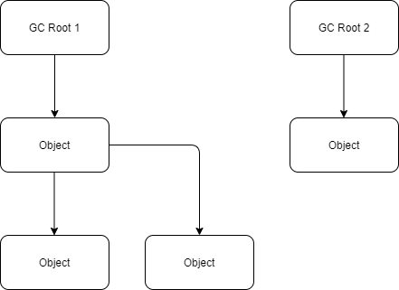

# 가비지 콜렉터란?

C#에선 프로그램을 실행하면 CLR이 managed heap (관리되는 heap)이라는 공간을 확보한다. 객체를 생성되면 객체에 대한 메모리가 heap에 할당되고CLR (Common Language Runtime)은 런타임시 heap에서 메모리를 관리해준다. 그리고 객체를 생성될 때마다 순서대로 메모리에 할당한다. 이때, 포인터를 사용해서 다음 객체가 올 위치에 대한 주소를 참조한다 (bump the pointer = 포인터 증가시킴). 이런식으로 객체가 추가되면서 heap이 다 차게되는데 이 때 등장하는 것이 바로 가비지 콜렉터이다. 개발자가 매번 메모리를 비워줄 필요없이 가비지 콜렉터(GC)가 알아서 **사용되지 않는(unreachable) 메모리 공간을 수거**해준다.

# Mark, Sweep, Compact

가비지 콜렉터는 Mark-Compact 알고리즘을 사용한다. 가비지 콜렉터가 사이클을 돌기 시작할때 일단 모든 객체를 garbage라고 간주하고 애플리케이션의 루트 참조(roots reference)를 순회한다. 여기서 루트가 될 수 있는 게 네 가지 정도 있다.

-   **Stack 참조** - 로컬 객체 참조. 메소드 실행 중에만 존재.
    
-   **Static 참조** - static 객체 참조. 애플리케이션 도메인 라이프 사이클 전체동안 존재.
    
-   **Handles** - unmanaged 코드와 managed 코드 간에 상호작용을 참조. unmanaged 코드가 managed 객체를 필요로 할 때까지 존재.
    
-   **Finalizer** 참조 - finalized 대기중인 객체를 참조. finalizer가 실행될 때까지 존재.
    

GC는 이 루트 참조를 가지고 모든 reachable한 객체를 순회하면서 graph를 완성시켜 나간다. 정리하자면 루트 하나가 참조하는 객체, 그리고 그 객체가 참조하는 객체 등등을 찾으면서 tree 형태가 된다.

그리고 참조하는 객체를 다 찾으면 다음 객체로 넘어가 같은 프로세스를 반복한다. 이런 탐색 과정을 `Mark`라고 한다. `Sweep`과정에서 Mark되지 않는 메모리를 해제한 다음 사용하는 객체를 heap에 재배치를 해서 사용되지 않는 메모리를 덮어쓴다. 이 과정을 `Compact`라고 한다. 메모리의 구멍을 메워주는 작업이라고 볼 수 있다. 이 compaction 작업이 끝나면 서로 맞닿아 있는 **SOH**(Small Object Heap)이 만들어 진다. 그리고 GC는 roots를 수정해서 포인터가 객체의 새로운 위치를 참조하도록 한다.

# SOH vs LOH

CLR은 heap을 크게 두 부분으로 나누어 관리한다. 바로 SOH(Small Object Heap)와 LOH(Large Object Heap)이다. SOH는 **Gen0, Gen1, Gen2** 세 가지로 나눌 수 있다. Java에서도 old 공간, young 공간이 분리된 것처럼 최근에 생성된 (young) 객체는 Gen0으로 분류하고 1회 GC 때 살아 남은 (old) 객체는 Gen1, 2회 이상 GC 후에 남아 있는 객체 (older?)는 Gen2가 된다. 즉, Gen0이 가득 차서 GC가 실행될 때 남은 객체가 Gen1로 승격되고 Gen1의 GC 후 살아남은 객체가 다시 Gen2로 승격되는 식이다. 그리고 Gen2가 가득 차면 Full GC를 수행하게된다. 이 때, CLR은 애플리케이션을 잠시 중단하여 메모리를 최적화한다. 이를 **stop the world** 라고 부른다. 모든 수행중인 thread를 중단하고 GC thread를 실행시킨다.

참고로 Full GC는 Gen0 과 Gen1 GC까지 함께 수행하기 때문에 비용이 크다. GC가 수행될 때 CPU와 메모리가 사용되므로 GC가 적은 비용을 들일 수 있게 최적화하는 것이 필요하다.

LOH는 이름 그대로 큰 객체가 관리되는 heap을 말한다. 85k 바이트 이상의 크기일 경우 LOH에 객체가 할당된다. LOH가 할당될 공간을 탐색하는데 이때 compaction은 수행되지 않는다. 객체를 복사하는 비용이 비싸기 때문이다. 메모리 낭비다. 크기가 큰 객체가 할당되면 GC가 자주 일어나기 때문에 이런 객체는 지양하는 것이 좋다.

# Finalize 함수

GC에 의해 호출되는 함수이고 managed heap에서 작동한다. GC가 객체를 제거되는 바로 직전에 호출되어 메모리를 없앤다. `~(물결모양)`을 함수 앞에 붙여 소멸자를 구현한다. 컴파일 시 `Finalize()` 함수로 변환된다.

# IDisposable 인터페이스

Garbage Collector가 수행되기 전에 메모리를 없애준다. Stream 같이 unmanaged heap에 있는 객체를 처리할 경우 이 인터페이스를 구현해 필요없는 객체를 제거한다.

# Reference:

[Jetbrain - Analyzing CG Roots](https://www.jetbrains.com/help/dotmemory/Analyzing_GC_Roots.html)

Jawahar Puvvala & Alok Pota - NET for Java Developers Migrating to C#

Mark Michaelis - Essential C# 7.0

[Microsoft - Automatic Memory Management](https://docs.microsoft.com/en-us/dotnet/standard/automatic-memory-management)

[DAWID SIBIŃSKI - Garbage collection: marking, collection and heaps compaction](https://www.codejourney.net/2018/08/net-internals-05-garbage-collection-marking-collection-and-heaps-compaction/)

[Microsoft - Back To Basics: Mark and Sweep Garbage Collection](https://docs.microsoft.com/ko-kr/archive/blogs/abhinaba/back-to-basics-mark-and-sweep-garbage-collection)