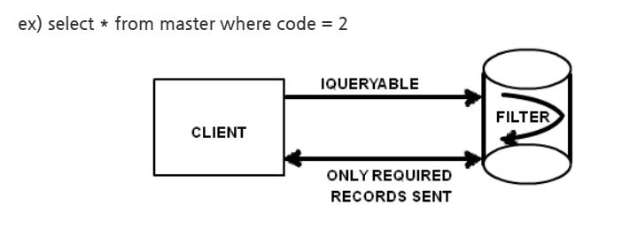
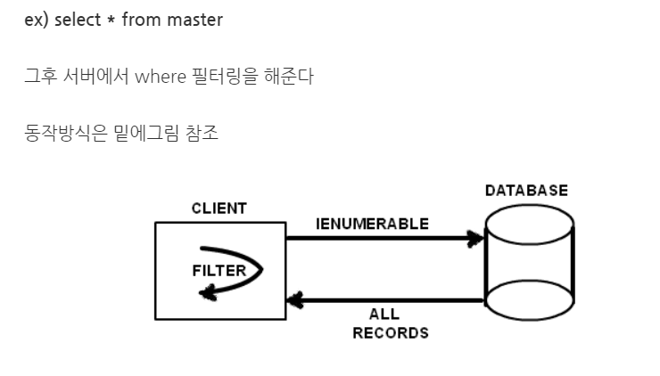

# IEnumerable vs IQueryable

- IQueryable is an interface that allows LINQ-to-SQL(LINQ.-to-anything) to work.
    - System.Linq Namespace
    - Derived from IEnumerable
    - IQueryable executes the query in the database where possible
    - Loads the filtered results on database memory

        

    - *Queryable<T> can retrieve **only filtered records** without loading all records. No records are in-memory.

    ```csharp
    IQueryable<Article> articles = ArticlesService.getArticlesWithQueryable();
    var notcieArticles = articles.Where(a => a.IsNotice); //Execute SQL
    ```

- IEnumerable는 LINQ-to-object
    - all matching objects to the query are loaded in database memory

        

    - filtering occurs at the client side

```csharp
IEnumerable<Article> articles = ArticlesService.getArticlesWithEnumerable();
var notcieArticles = articles.Where(a => a.IsNotice); 
```