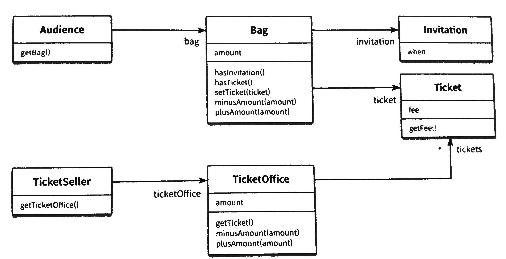
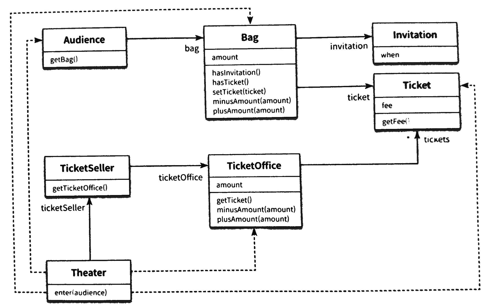
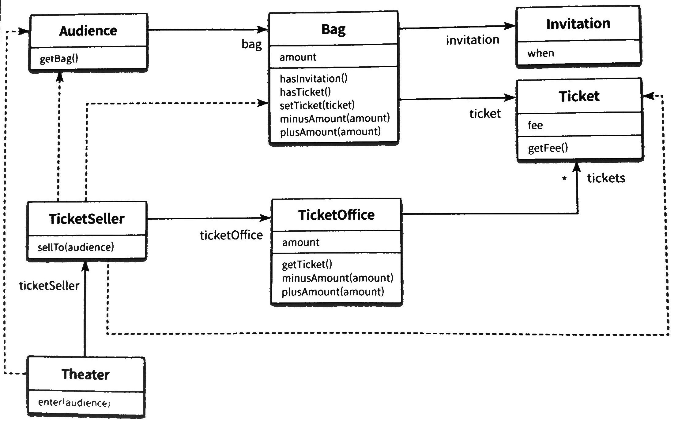
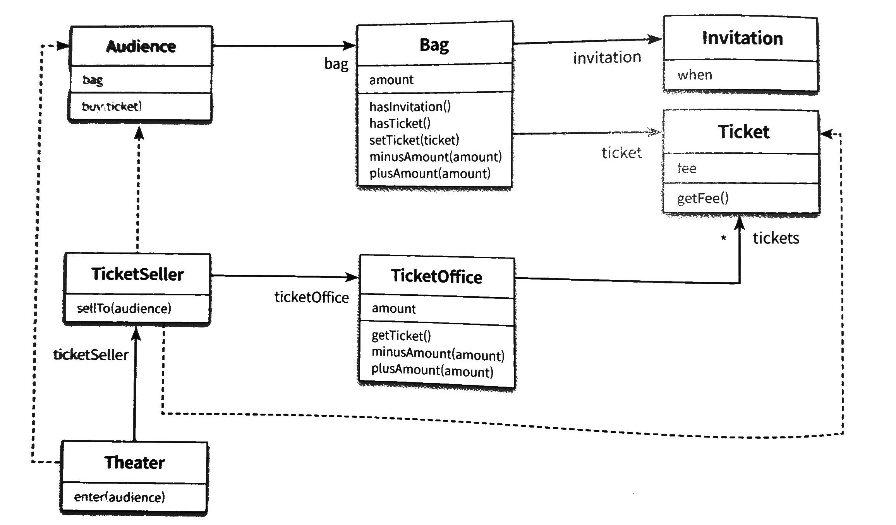
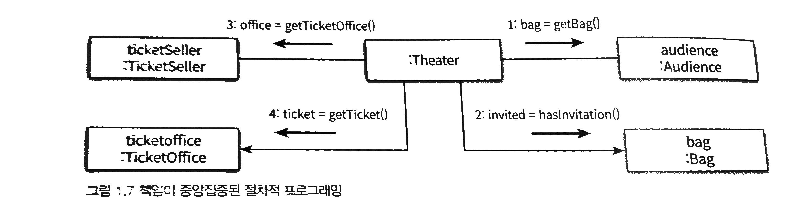
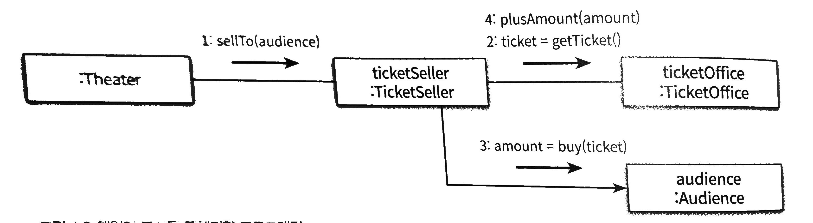

# Theatre ticket sales application

## Requirement

- Event
    - Send an free screening invite to an audience who won the event
    - If no invite, an audience needs to purchase a ticket
- Ticket Booth
    - A staff sells/exchanges tickets
    - Ticket booth deals with tickets and pricing
- Audience
    - Bag, Money, Ticket
    - Invite (can be null)

## As-is Architecture



### Audience

```java
public class Audience{
    private Bag bag;

    public Audience(Bag bag){
        this.bag = bag;
    }

    public Bag getBag(){
        return bag;
    }
}
```

### Bag

```java
public class Bag {
    private Long amount;
    private Invitation invitation;
    private Ticket ticket;

    public Bag(Long amount){
        this(null, amount);
    }

    public Bag(Invitation invitation, Long amount){
        this.invitation = invitation;
        this.amount = amount;
    }

    public boolean hasInvitation(){
        return invitation != null;
    }

    public boolean hasTicket(){
        return ticket != null;
    }

    public void setTicket(Ticket ticket){
        this.ticket = ticket;
    }

    public void minusAmount(Long amount){
        this.amount -= amount;
    }

    public void plusAmount(Long amount){
        this.amount += amount;
    }
}
```

### Invitation

```java
public class Invitation {
    private LocalDateTime when;
}
```

### Theater

```java
public class Theater{
    private TicketSeller ticketSeller;

    public Theater(TicketSeller ticketSeller){
        this.ticketSeller ticketSeller;
    }

    //dependency-> independency
    public void enter(Audience audience){
        if(audience.getBag().hasInvitation()){
            Ticket ticket = ticketSeller.getTicketOffice().getTicket();
            audience.getBag().setTicket(ticket);
        }else{
            Ticket ticket = ticketSeller.getTicketOffice().getTicket();
            audience.getBag().minusAmount(ticket.getFee());
            ticketSeller.getTicketOffice().plusAmount(ticket.getfee());
            ticketSeller.getTicketOffice().plusAmount(ticket.getFee());
            audience.getBag().setTicket(ticket);
        }
    }
}
```

### Ticket

```java
public class Ticket {
    private Long fee;

    public Long getFee(){
        return fee;
    }
}
```

### TicketOffice

```java
public class TicketOffice{
    private Long amount;
    private List<Ticket> tickets = new ArrayList<>();

    public TicketOffice(Long amount, Ticket ... tickets){
        this.amount = amount;
        this.tickets.addAll(Arrays.asList(tickets));
    }

    public Ticket getTicket(){
        return tickets.remove(0);
    }

    public void minusAmount(Long amount){
        this.amount -= amount;
    }

    public void plusAmount(Long amount){
        this.amount += amount;
    }
}
```

### TicketSeller

```java
public class TicketSeller{
    private TicketOffice ticketOffice;

    public TicketSeller(TicketOffice ticketOffice){
        this.ticketOffice = ticketOffice;
    }

    public TicketOffice getTicketOffice(){
        return ticketOffice;
    }
}
```

## Issue

- Robert C. Martin - Agile Software Development: The Cooperative Game

    > Three purposes of module

    1. Behave as expected during the execution
    2. Easy to change
    3. Easy to read



## Improvement

- Add independency

### Theater

```java
public class Theater{
    private TicketSeller ticketSeller;

    public Theater(TicketSeller ticketSeller){
        this.ticketSeller ticketSeller;
    }

    public void enter(Audience audience){
        //The change within sellTo method has no effect on theatre
        ticketSller.sellTo(audience);
        // if(audience.getBag().hasInvitation()){
        //     Ticket ticket = ticketSeller.getTicketOffice().getTicket();
        //     audience.getBag().setTicket(ticket);
        // }else{
        //     Ticket ticket = ticketSeller.getTicketOffice().getTicket();
        //     audience.getBag().minusAmount(ticket.getFee());
        //     ticketSeller.getTicketOffice().plusAmount(ticket.getfee());
        //     ticketSeller.getTicketOffice().plusAmount(ticket.getFee());
        //     audience.getBag().setTicket(ticket);
        // }
    }
}
```

→ Dependent on TicketSeller's interface only

→ Removed TicketOffice's dependency

### TicketSeller

```java
public class TicketSeller{
    private TicketOffice ticketOffice;

    public TicketSeller(TicketOffice ticketOffice){
        this.ticketOffice = ticketOffice;
    }

    public TicketOffice getTicketOffice(){
         return ticketOffice;
    }

    //Encapsulation-> Hide what's inside the object
    public void sellTo(Audience audience){
        if(audience.getBag().hasInvitation()){
            Ticket ticket = ticketOffice.getTicket();
            audience.getBag().setTicket(ticket);
        }else{
            Ticket ticket = ticketOffice.getTicket();
            audience.getBag().minusAmount(ticket.getFee());
            ticketOffice.plusAmount(ticket.getFee());
            audience.getBag().setTicket(ticket);
        }
    }
}
```

→ Implementation happens here (Encapsulation)



### Audience

```java
public class Audience{
    private Bag bag;

    //Encapsulate bag
    //Only audience can know
    public Audience(Bag bag){
        this.bag = bag;
    }

    // public Bag getBag(){
    //     return bag;
    // }
    public Long buy(Ticket ticket){
        if(bag.hasInvitation()){
            bag.setTicket(ticket);
            return 0L;
        }else{
            bag.setTicket(ticket);
            bag.minusAmount(ticket.getFee());
            return ticket.getFee();
        }
    }
}
```

→ Implementation

### TicketSeller

```java
public class TicketSeller{
    private TicketOffice ticketOffice;

    public TicketSeller(TicketOffice ticketOffice){
        this.ticketOffice = ticketOffice;
    }

    public TicketOffice getTicketOffice(){
        return ticketOffice;
    }

    public void sellTo(Audience audience){
        ticketOffice.plusAmount(audience.buy(ticketOffice.getTicket());
    }
}
```

→ dependent on audience's interface only



→ Removed dependency from TicketSeller and Audience

→ Separate responsibilities of objects

### Audience

```java
public class Audience{
    private Bag bag;

    public Audience(Bag bag){
        this.bag = bag;
    }

    // public Bag getBag(){
    //     return bag;
    // }
    public Long buy(Ticket ticket){
        bag.hold();
    }
}
```

### Bag

```java
public class Bag {
    private Long amount;
    private Invitation invitation;
    private Ticket ticket;

    public Bag(Long amount){
        this(null, amount);
    }

    public Bag(Invitation invitation, Long amount){
        this.invitation = invitation;
        this.amount = amount;
    }

    public Long hold(Ticket ticket){
        if(hasInvitation()){
            setTicket(ticket);
            return 0L;
        }else{
            setTicket(ticket);
            minusAmount(ticket.getFee());
            return ticket.getFee();
        }
    }

    public boolean hasInvitation(){
        return invitation != null;
    }

    public boolean hasTicket(){
        return ticket != null;
    }

    public void setTicket(Ticket ticket){
        this.ticket = ticket;
    }

    public void minusAmount(Long amount){
        this.amount -= amount;
    }

    public void plusAmount(Long amount){
        this.amount += amount;
    }
}
```

# Trade off

### TicketSeller

```java
public class TicketSeller{
    private TicketOffice ticketOffice;

    public TicketSeller(TicketOffice ticketOffice){
        this.ticketOffice = ticketOffice;
    }

    // public TicketOffice getTicketOffice(){
    //     return ticketOffice;
    // }

    public void sellTo(Audience audience){
        ticketOffice.sellTicketTo(audience);
    }
}
```

### TicketOffice

```java
public class TicketOffice{
    private Long amount;
    private List<Ticket> tickets = new ArrayList<>();

    public TicketOffice(Long amount, Ticket ... tickets){
        this.amount = amount;
        this.tickets.addAll(Arrays.asList(tickets));
    }

    //Dependent on audience
    //Increased coupling
    //Need trade-off
    public sellTicketTo(Audience audience){
        plusAmount(audience.buy(getTicket()));
    }

    public Ticket getTicket(){
        return tickets.remove(0);
    }

    public void minusAmount(Long amount){
        this.amount -= amount;
    }

    public void plusAmount(Long amount){
        this.amount += amount;
    }
}
```

→ Adding more independency in TicketOffice introduced Audience's dependency

# Encapsulation and Cohesion

- Hide the inside of the object
- The interaction between objects by calling
- Cohesion
    - Execute relevat tasks only. Delegate the rest to other objects
    - Process its own data = Independency

# Process-orieted vs Object-oriented


- Process-oriented
    - Separate process and data in different modules
    - One process handles multiple data (One class manages other classes)
    - Not very intuitive
    - High dependency
    - Hard to change


- Object-oriented
    - A module has data and process
    - Process and data exist within the same class
    - Easy to change

# Separate of Responsibility

- Each objects has its own responsibility = oop
- Collaboration/Interfaction between objects
- Focus should be on responbility not data itself

# Effective architecture

- Remove unnecessary dependency to decrease the degree of coupling between objects
- Encapsulation is a good way to remove dependency
- High independency
- High cohesion
- Interaction between objects

# Trade off

- Dependency vs Independency
- It is not guaranteed that adding independency decreases dependency in the architecture as a whole

# Anthropomorphism

- Object modelling technique

# Good architecture

- A room for a change
    - Requirement is not fixed
    - Reduce the change of bugs
- Easy to read = Easy to change
- Manage dependency between objects accordingly