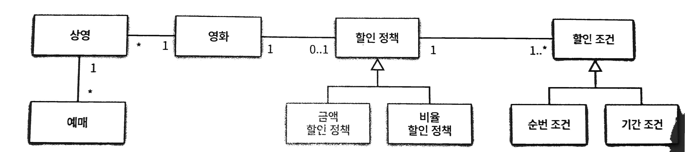

# 객체 지향 프로그래밍

## 영화 예매 시스템

### 요구사항

- 영화
    - 제목, 상영시간, 가격 정보
- 상영
    - 일자, 시간, 순번
- 특정 조건 만족 시 할인가능
    - 할인 조건
        - 순서할인
        - 기간할인
    - 할인 정책
        - 금액 할인 정책
        - 비율 할인 정책 (percentage)
- 영화별로 하나의 할인 정책만 할당.
    - 할인 정책 할당 안해도됨 (0개 이상)
- 다수의 할인 조건 지정 가느
- 예매
    - 제목
    - 상영정보
    - 인원
    - 정가
    - 결제금액

## 협력, 객체, 클래스

- 단순히 클래스부터 결정하는 것은 객체 지향과 거리가 멈
    - 클래스는 공통적인 상태, 행동을 공유하는 객체들을 추상화한 것
- 객체에 초점을 맞출 것
- 객체는 공동체의 일원
    - 상호작용

## 도메인 구조

- 도메인
    - 문제 해결을 위해 솔루션이 사용되는 분야
    - 클래스 이름에 대응되는 도메인 개념

## 클래스 구현

- 클래스 내부, 외부 경계 구분
    - private vs public

## 자율적인 객체

- 상태(state)와 행동(behaviour)를 함께 가짐
    - 객체의 상태는 숨기고 행동만 외부에 공개
        - property는 private으로
        - 일부 메소드는 public
- 스스로 판단, 행동하는 자율적인 존재
- 캡슐화
    - 객체 안에 기능과 데이터를 함께 묶음
- 접근 제어
    - 접근 수정자
        - private, public, protected
- 외부의 간섭 최소화
    - 인터페이스
        - 외부에서 접근 가능
    - 구현
        - 내부에서만 접근 가능

## 프로그래머의 역할

- 클래스 작성자 (백엔드)
    - 새로운 데이터 타입을 프로그램에 추가
    - 필요한 부분만 클라이언트에 공개
- 클라이언트 프로그래머 (프론트엔드)
    - 클래스 작성자가 추가한 데이터 타입을 사용
    - 클래스를 엮어 애플리케이션을 효율적으로 구축
- 구현 은닉 (Implementation hiding)

## 객체 협력

- 협력 (Collaboration)
    - 객체 간의 상호작용
- 요청 (request)
    - 전송
- 응답 (response)
    - 수신
- 메서드
    - 메시지를 처리
- 다형성 (polymorphism)