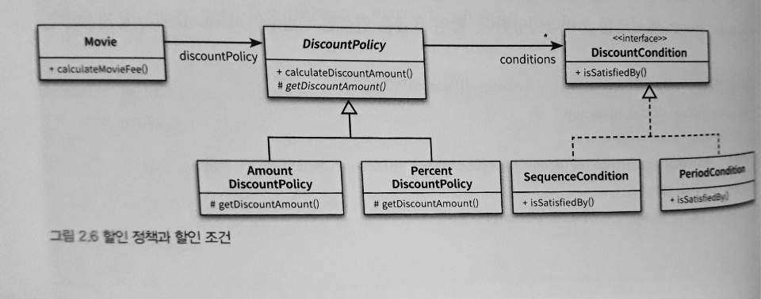

# 객체지향 프로그래밍2
## 할인 요금 구하기

```
public class Movie {
    private String title;
    private Duration runningTime;
    private Money fee;
    private DiscountPolicy discountPolicy;

    public Movie(Stirng title, Duration runningTime, Money fee, DiscountPolicy discountPolicy){
        this.title = title;
        this.runningTime = runningTime;
        this.fee = fee;
        this.discountPolicy = discountPolicy;
    }

    public Money getFee(){
        return fee;
    }

    public Money calculateMovieFee(Screening screening){
        return fee.minus(discountPolicy.calculateDiscountAmount(screening));
    }
}
```

## 할인 정책과 할인 조건
- 할인 정책
    - 금액 할인 정책 ➡ AmountDiscountPolicy
    - 비율 할인 정책 (percentage) ➡ PercentDiscountPolicy
- 부모 클래스 DiscountPolicy
- 비슷한 기능을 하지만 구현 방식이 다를 때, abstract class 사용

### DiscountPolicy.java
```
public class DiscountPolicy {
    private List<DiscountCondition> conditions = new ArrayList<>();

    public DiscountPolicy(DiscountCondition ... conditions){
        this.conditons = Arrays.asList(conditions);
    }

    public Money calculateDiscountAmount(Screening screening){
        for(DiscountCondition each : conditions){
            if(each.isSatisfiedBy(screening){
                if(each.isSatisfiedBy(screening)){
                    //조건을 만족하면 함수 호출
                    return getDiscountAmount(screening);
                }
            })
        }

        return Money.ZERO;
    }

    abstract protected Money getDiscountAmount(Screening Screening);
}
```

### DiscountCondition.java
```
public interface DiscountCondition {
    boolean isSatisfiedBy(Screening screening);
}
```

### SequenceCondition.java
```
public class SequenceCondition implements DiscountCondition {
    private int sequence;

    public SequenceCondition(int sequence){
        this.sequence = sequence;
    }

    public boolean isSatisfiedBy(Screening screening){
        return screening.isSequence(sequence);
    }
}
```

### PeriodCondition.java
```
import java.time.LocalTime;

public class PeriodCondition implements DiscountCondition {
    private DayOfWeek dayOfWeek;
    private LocalTime startTime;
    private LocalTime endTime;

    public PeriodCondition(DayOfWeek dayOfWeek, LocalTime startTime, LocalTime endTime){
        this.dayOfWeek = dayOfWeek;
        this.startTime = startTime;
        this.endTime = endTime;
    }

    //상영 기간에 있음 && 상영 시작 시간 후 && 상영 종료 시간 전 
    public boolean isSatisfiedBy(Screening screening){
        return screening.getStartTime().getDayOfWeek().equals(dayOfWeek) && startTime.compareTo(screening.getStartTime().toLocalTime()) <= 0 && endTime.compareTo(screening.getStartTime().toLocalTime()) >= 0;
    }
}
```

### AmountDiscountPolicy.java
```
public class AmountDiscountPolicy extends DiscountPolicy {
    private Money discountAmount;

    public AmountDiscountPolicy(Money discountAmount, DiscountCondition ... conditions){
        super(conditions);
        this.discountAmount = discountAmount;
    }
        
    //추상 함수 구현
    @Override
    protected Money getDiscountAmount(Screening screening){
        return discountAmount;
    }
}
```

### PercentDiscountPolicy.java
```
public class PercentDiscountPolicy extends DiscountPolicy {
    private double percent;

    public PercentDiscountPolicy(double percent, DiscountCondition ...conditions){
        super(conditions);
        this.percent = percent;
    }

    @Override
    protected Money getDiscountAmount(Screening screening){
        return screening.getMovieFee().times(percent);
    }
}
```



## 오버라이딩 vs 오버로딩
- 오버라이딩
  - 재정의
  - 런타임
- 오버로딩
  - 파라미터 목록이 다름
  - 컴파일