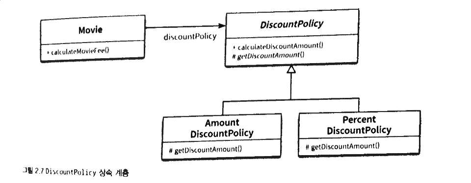
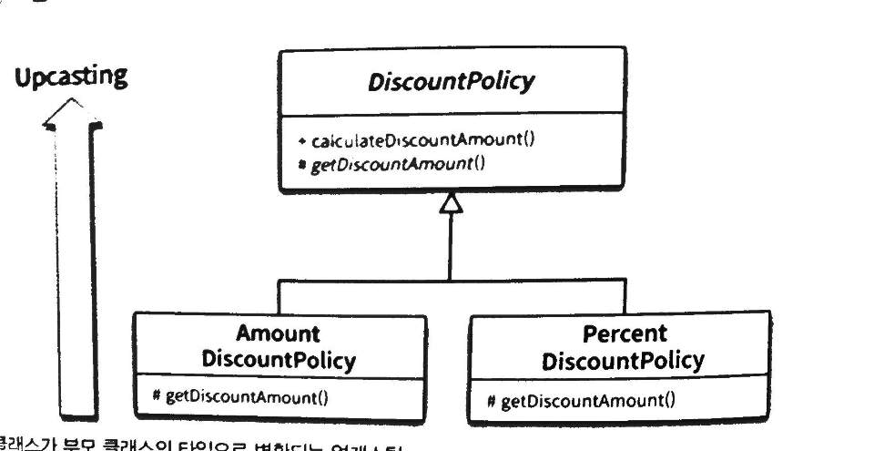
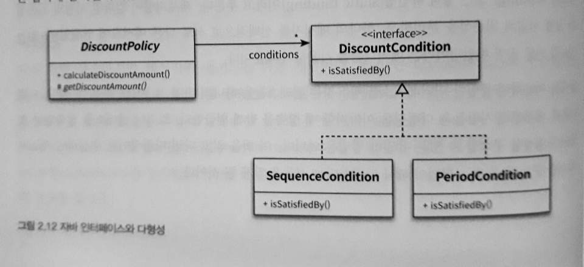
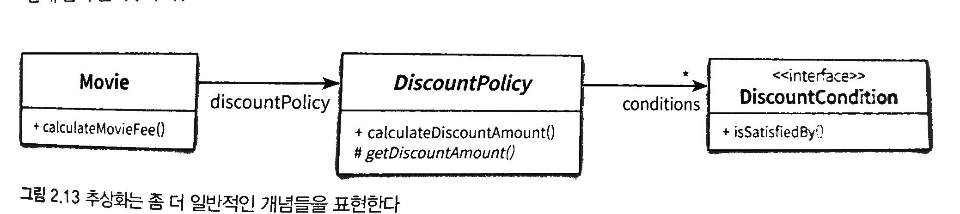
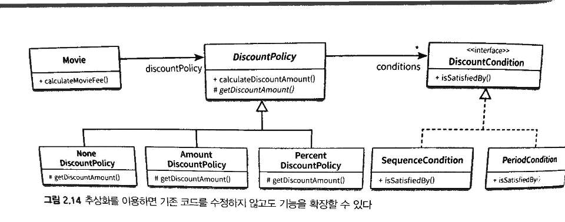
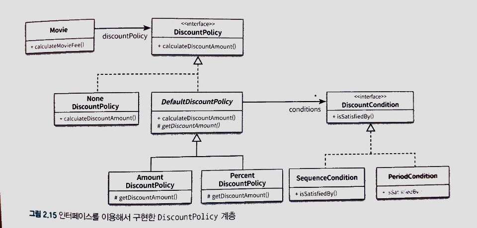
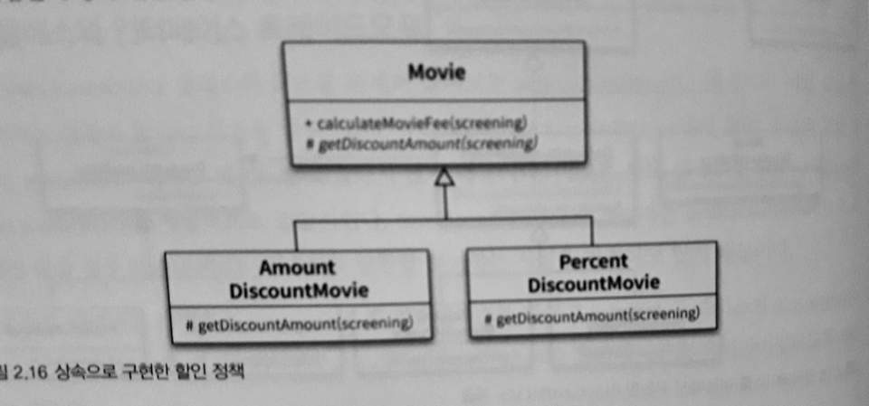

# 객체지향 프로그래밍3
## 할인 정책 구성하기
### 예시
- 금액 할인
```
Movie avatar = new Movie("아바타", Duration.ofMinutes(120), Money.wons(10000), new AmountDiscountPolicy(Money.wons(800), new SequenceCondition(1), new SequenceCondition(10), new PeriodCondition(DayOfWeek.MONDAY, LocalTime.of(10,0), LocalTime.of(11, 59)), new PeriodCondition(DayOfWeek.THURSDAY, LocalTime.of(10,0), LocalTime.of(20, 59))));
```

- 비율 할인
```
Movie titanic = new Movie("타이타닉", Duration.ofMinutes(180), Money.wons(11000), new PercentDiscountPolicy(0.1, new PeriodCondition(DayOfWeek.TUESDAY, LocalTime.of(14, 0), LocalTime.of(16, 59)), new SequenceCondition(2), new PeriodCondition(DayOfWeek.THURSDAY, LocalTime.of(10, 0), LocalTime.of(13, 59))));
```

## 상속과 다형성
### 컴파일 시간 의존성과 실행 시간 의존성


- Movie가 할인 정책을 구현한 클래스 인스턴스에 의존함
- 코드 수준에서는 의존하지 않음. 오직 추상 클래스를 의존


- 코드의 의존성과 실행 시점의 의존성은 다를 수 있음
- 이렇게 의존성이 다르면 코드 이해가 어려워질 수 있지만 유연하고 확장 가능해짐
- 설계가 유연해질 수록 코드의 readability가 감소하고 디버깅하기 어려워짐
- Trade off

## 차이에 의한 프로그래밍
- 상속은 코드 재상용을 위해 사용되는 방법
- 부모 클래스의 행동을 공유하면서 자신 클래스에 다른 행동을 쉽게 추가 가능
- programming by difference

## 상속과 인터페이스
- 인터페이스는 객체가 이해할 수 있는 메시지 목록을 정의
- 컴파일러는 코드 상에서 부모 클래스가 나오는 모든 장소에서 자식 클래스를 사용할 수 있도록 함

### 업캐스팅
- 클래스의 형변환
- 자식 클래스가 부모 클래스를 대신함


## 다형성
- 컴파일 시간 의존성 (compile)과 실행 시간 의존성 (runtime)이 다를 수 있음을 기반으로함
- compile 시에는 Movie와 DiscountPolicy가 상호작용
- runtime 시에는 Movie와 AmountDiscountPolicy/PercentDiscountPolicy가 상호작용
- 동일한 메시지를 수신했을 때 객체의 타입에 따라 다르게 응답할 수 있는 능력
  - 인터페이스가 동일해야 객체들이 메시지를 이해할 수 있음
  - 메시지에 응답하려면 메서드를 runtime 시점 때 결정해야함 ➡ lazy binding (동적 바인딩)
  - 컴파일 시점 때 바인딩하면 early binding 또는 정적 바인딩
- 객체지향에서는 compile 의존성과 runtime 의존성을 분리.
- 상속으로 인터페이스를 공유하는 클래스를 하나의 타입 계층으로 묶을 수 있음

## 구현 상속 vs 인터페이스 상속
- 구현 상속 = subclassing
  - 코드 재사용 목적
- 인터페이스 상속 = subtyping
  - 다형적인 협력을 위해 인터페이스 공유
- 상속은 구현 상속이 아니라 인터페이스 상속을 위해 사용해야함

## 인터페이스와 다형성

- DiscountCondition을 실체화하는 클래스는 동일한 인터페이스를 공유
- DiscountCondition을 대신해서 사용될 수 있음
- 업캐스팅
- 다형적 협력

## 추상화의 장점

- 추상화의 계층만 따로 보면 요구사항의 정책을 high level에서 서술 가능
  - 상위 개념만으로 도메인의 개념 설명 가능
  - 기본적인 협력 흐름을 기술
- 추상화를 이용하면 설계가 유연해짐
- 디자인 패턴, 프레임워크 모두 추상화를 이용해 상위 정책을 정의하는 객체지향의 성향을 활용

## 유연한 설계
- 할인 정책이 없는 경우

### NoneDiscountPolicy.java

```
public class NoneDiscountPolicy extends DiscountPolicy {
    @Override
    protected Money getDiscountAmount(Screening screening){
        return Money.ZERO;
    }
}
```
- Context의 독립성
- 추상화를 이용하면 기존 코드 수정 없이 기능 확장 가능



## 추상 클래스와 인터페이스 트레이드오프
### Movie.java
```
public class Movie {
    private String title;
    private Duration runningTime;
    private Money fee;
    private DiscountPolicy discountPolicy;

    public Movie(Stirng title, Duration runningTime, Money fee, DiscountPolicy discountPolicy){
        this.title = title;
        this.runningTime = runningTime;
        this.fee = fee;
        //오직 하나의 할인 정책만 적용됨
        this.discountPolicy = discountPolicy;
    }

    public Money getFee(){
        return fee;
    }

    public Money calculateMovieFee(Screening screening){
        // 할인 정책이 없는 경우
        // Movie가 책임을 가지는 것은 설계 측면에서 좋지 않음
        // 예외 케이스를 최소화하고 일관성을 유지할 수 있는 방법을 선택할 것
        // 할인 요금이 없는 시나리오는 DiscountPolicy가 책임을 져야함
        if(discountPolicy == null){
            return fee;
        }
        return fee.minus(discountPolicy.calculateDiscountAmount(screening));
    }
}
```

- 할인 조건이 없을 경우 getDiscountAmount()를 호출하지 않음
  - DiscountPolicy가 0원을 반환할 것이라 가정을 해야함

### DicountPolicy.java
```
public interface DiscountPolicy {
    Money calculateDiscountAmount(Screening screening);
}
```

### DefaultDiscountPolicy.java
```
public abstract class DefaultDiscountPolicy implements DiscountPolicy {
    private List<DiscountCondition> conditions = new ArrayList<>();

    public DiscountPolicy(DiscountCondition ... conditions){
        this.conditons = Arrays.asList(conditions);
    }

    public Money calculateDiscountAmount(Screening screening){
        for(DiscountCondition each : conditions){
            if(each.isSatisfiedBy(screening)){
                if(each.isSatisfiedBy(screening)){
                    //조건을 만족하면 추상함수 호출
                    //자식 클래스에서 구현된 (오버라이딩) 메서드 실행
                    // 템플릿 메소드 패턴
                    return getDiscountAmount(screening);
                }
            }
        }

        return Money.ZERO;
    }

    abstract protected Money getDiscountAmount(Screening screening);
}
```

### NoneDiscountPolicy.java
```
public class NoneDiscountPolicy implements DiscountPolicy {
    @Override
    public Money calculateDiscountAmount(Screening screening){
        return Money.ZERO;
    }
}
```



- 인터페이스를 사용하는 설계

## 코드 재사용
- 코드 재사용은 상속보다 합성 (composition)을 사용하자
- 합성은 다른 객체의 인스턴스를 자신의 인스턴스 변수로 포함해서 재사용하는 방법
- Movie가 DiscountPolicy의 코드를 재사용하는 방법이 합성


- 상속으로 구현한 할인 정책

## 상속
- 상속은 캡슐화를 위반하고 설계를 유연하지 못하게 만듬
- 부모 클래스의 구현이 자식 클래스에 노출됨
- 부모와 자식의 coupling이 높음
- 컴파일 시점 때 부모-자식 관계가 결정되어 실행 시점 때 객체 종류 변경이 불가능

```
public class Movie {
    private String title;
    private Duration runningTime;
    private Money fee;
    private DiscountPolicy discountPolicy;

    public Movie(Stirng title, Duration runningTime, Money fee, DiscountPolicy discountPolicy){
        this.title = title;
        this.runningTime = runningTime;
        this.fee = fee;
        //오직 하나의 할인 정책만 적용됨
        this.discountPolicy = discountPolicy;
    }

    public Money getFee(){
        return fee;
    }

    public Money calculateMovieFee(Screening screening){
        // 할인 정책이 없는 경우
        // Movie가 책임을 가지는 것은 설계 측면에서 좋지 않음
        // 예외 케이스를 최소화하고 일관성을 유지할 수 있는 방법을 선택할 것
        // 할인 요금이 없는 시나리오는 DiscountPolicy가 책임을 져야함
        // if(discountPolicy == null){
        //     return fee;
        // }
        return fee.minus(discountPolicy.calculateDiscountAmount(screening));
    }

    public void changeDiscountPolicy(DiscountPolicy discountPolicy){
        this.discountPolicy = discountPolicy;
    }
}
```
- 비율 할인 정책을 변경할 수 있도록 함

## 합성
- 인터페이스를 통해 결합을 약화시킴
- 어떤 함수를 제공한다는 사실을 알지만 내부 구현은 모름
- 캡슐화
- 다형성 vs 코드 재사용