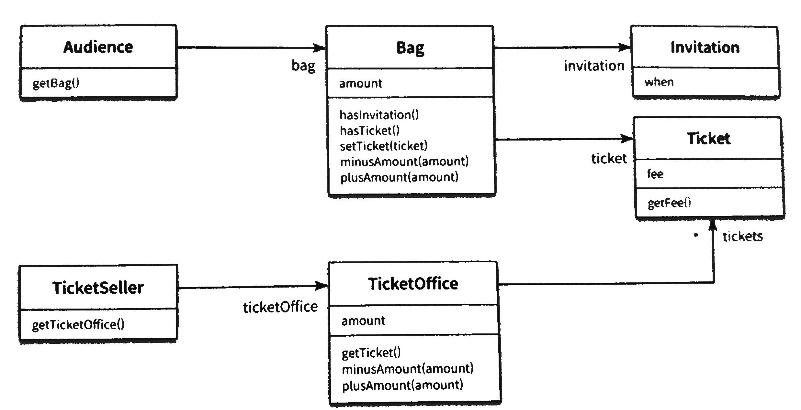
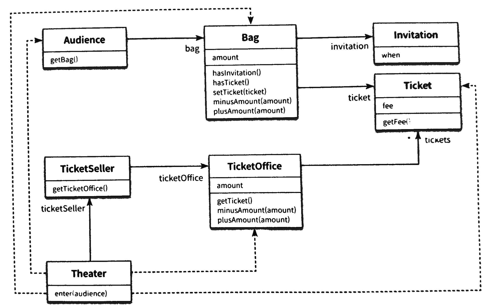
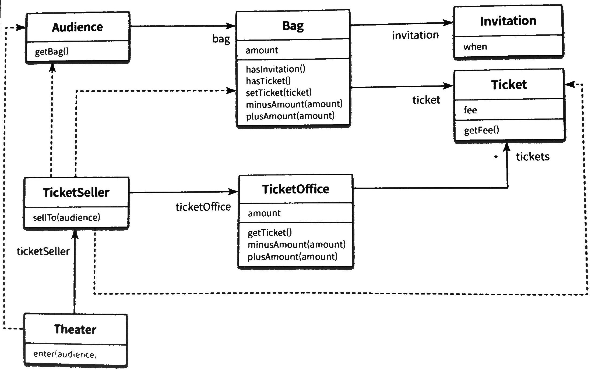
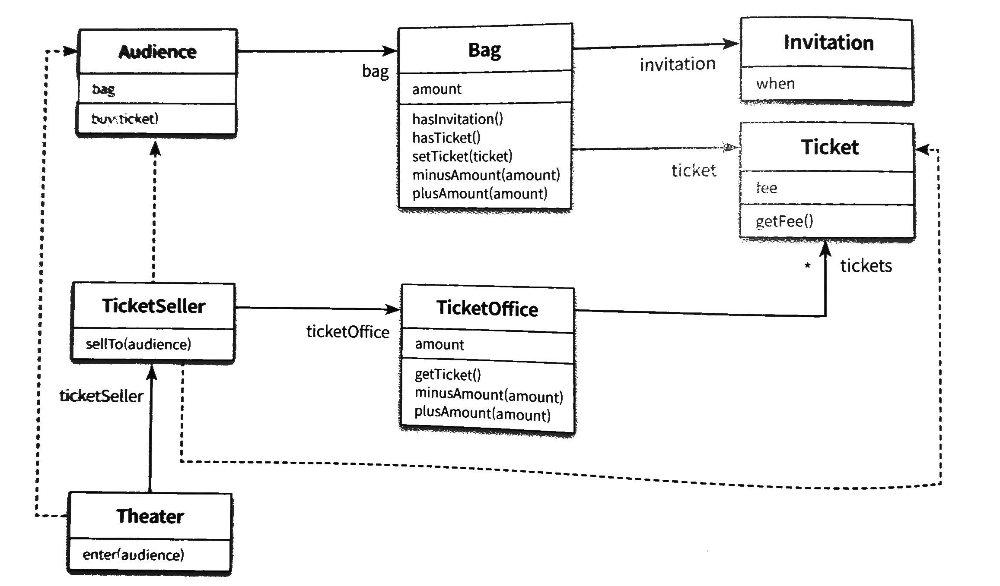
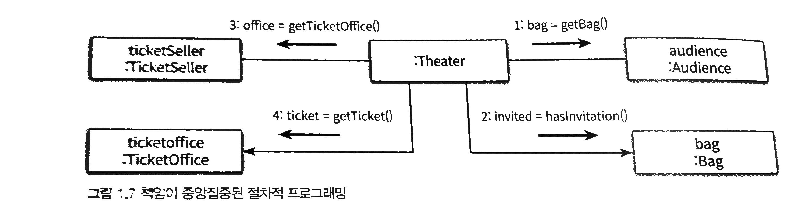
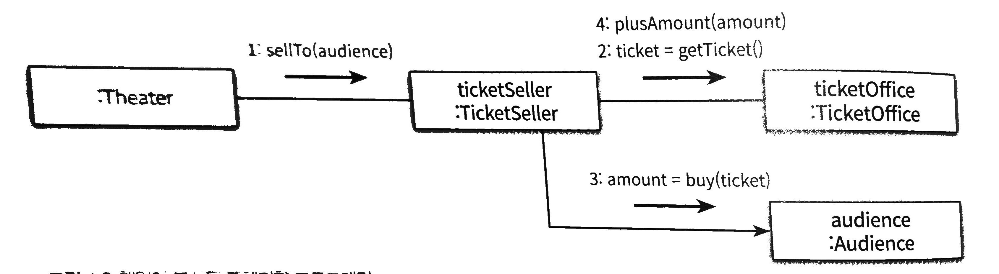

# 극장 티켓 판매 애플리케이션

## 요구사항

- 극장 이벤트가 존재
    - 이벤트에 당첨된 사람에게 초대장 보냄
    - 이벤트에 당첨되지 않은 사람은 티켓을 구매
- 소극장에는 매표소가 있음
    - 매표소에서 판매원이 티켓 판매 및 교환
    - 매표소에는 티켓과 판매 금액
- 관객의 소지품
    - 가방, 현금, 티켓
- 이벤트에 당첨되지 않은 사람은 초대장을 가지고 있지 않음 (null)

## 첫 설계


그림 1.1

### Audience

```java
public class Audience{
    private Bag bag;

    public Audience(Bag bag){
        this.bag = bag;
    }

    public Bag getBag(){
        return bag;
    }
}
```

### Bag

```java
public class Bag {
    private Long amount;
    private Invitation invitation;
    private Ticket ticket;

    public Bag(Long amount){
        this(null, amount);
    }

    public Bag(Invitation invitation, Long amount){
        this.invitation = invitation;
        this.amount = amount;
    }

    public boolean hasInvitation(){
        return invitation != null;
    }

    public boolean hasTicket(){
        return ticket != null;
    }

    public void setTicket(Ticket ticket){
        this.ticket = ticket;
    }

    public void minusAmount(Long amount){
        this.amount -= amount;
    }

    public void plusAmount(Long amount){
        this.amount += amount;
    }
}
```

### Invitation

```java
public class Invitation {
    private LocalDateTime when;
}
```

### Theater

```java
public class Theater{
    private TicketSeller ticketSeller;

    public Theater(TicketSeller ticketSeller){
        this.ticketSeller ticketSeller;
    }

    //의존성 문제 -> 자율성을 높이기
    public void enter(Audience audience){
        if(audience.getBag().hasInvitation()){
            Ticket ticket = ticketSeller.getTicketOffice().getTicket();
            audience.getBag().setTicket(ticket);
        }else{
            Ticket ticket = ticketSeller.getTicketOffice().getTicket();
            audience.getBag().minusAmount(ticket.getFee());
            ticketSeller.getTicketOffice().plusAmount(ticket.getfee());
            ticketSeller.getTicketOffice().plusAmount(ticket.getFee());
            audience.getBag().setTicket(ticket);
        }
    }
}
```

### Ticket

```java
public class Ticket {
    private Long fee;

    public Long getFee(){
        return fee;
    }
}
```

### TicketOffice

```java
public class TicketOffice{
    private Long amount;
    private List<Ticket> tickets = new ArrayList<>();

    public TicketOffice(Long amount, Ticket ... tickets){
        this.amount = amount;
        this.tickets.addAll(Arrays.asList(tickets));
    }

    public Ticket getTicket(){
        return tickets.remove(0);
    }

    public void minusAmount(Long amount){
        this.amount -= amount;
    }

    public void plusAmount(Long amount){
        this.amount += amount;
    }
}
```

### TicketSeller

```java
public class TicketSeller{
    private TicketOffice ticketOffice;

    public TicketSeller(TicketOffice ticketOffice){
        this.ticketOffice = ticketOffice;
    }

    public TicketOffice getTicketOffice(){
        return ticketOffice;
    }
}
```

## 무엇이 문제?

- 로버트 마틴 - 클린 소프트웨어

    > 모듈의 세 가지 목적

    1. 실행 중 제대로 동작
    2. 변경가능할 것
    3. 읽기 쉬운 코드


그림 1.2

## 설계 개선

- 자율성을 높이자

### Theater

```java
public class Theater{
    private TicketSeller ticketSeller;

    public Theater(TicketSeller ticketSeller){
        this.ticketSeller ticketSeller;
    }

    //의존성 문제 -> 자율성을 높이기
    public void enter(Audience audience){
        //sellTo의 내부 코드가 바뀌어도 theater에는 영향이 없음
        ticketSller.sellTo(audience);
        // if(audience.getBag().hasInvitation()){
        //     Ticket ticket = ticketSeller.getTicketOffice().getTicket();
        //     audience.getBag().setTicket(ticket);
        // }else{
        //     Ticket ticket = ticketSeller.getTicketOffice().getTicket();
        //     audience.getBag().minusAmount(ticket.getFee());
        //     ticketSeller.getTicketOffice().plusAmount(ticket.getfee());
        //     ticketSeller.getTicketOffice().plusAmount(ticket.getFee());
        //     audience.getBag().setTicket(ticket);
        // }
    }
}
```

→ TicketSeller의 인터페이스에만 의존

→ TicketOffice의 의존성을 제거

### TicketSeller

```java
public class TicketSeller{
    private TicketOffice ticketOffice;

    public TicketSeller(TicketOffice ticketOffice){
        this.ticketOffice = ticketOffice;
    }

    public TicketOffice getTicketOffice(){
         return ticketOffice;
    }

    //캡슐화 -> 객체 내부의 세부적인 사항을 감추는 것
    public void sellTo(Audience audience){
				if(audience.getBag().hasInvitation()){
            Ticket ticket = ticketOffice.getTicket();
            audience.getBag().setTicket(ticket);
        }else{
            Ticket ticket = ticketOffice.getTicket();
            audience.getBag().minusAmount(ticket.getFee());
            ticketOffice.plusAmount(ticket.getFee());
            audience.getBag().setTicket(ticket);
        }
    }
}
```

→ 구현은 여기서 (캡슐화)


그림 1.3

### Audience

```java
public class Audience{
    private Bag bag;

    //bag을 내부로 캡슐화
    //audience만 알 수 있음
    public Audience(Bag bag){
        this.bag = bag;
    }

    // public Bag getBag(){
    //     return bag;
    // }
    public Long buy(Ticket ticket){
        if(bag.hasInvitation()){
            bag.setTicket(ticket);
            return 0L;
        }else{
            bag.setTicket(ticket);
            bag.minusAmount(ticket.getFee());
            return ticket.getFee();
        }
    }
}
```

→ 구현

### TicketSeller

```java
public class TicketSeller{
    private TicketOffice ticketOffice;

    public TicketSeller(TicketOffice ticketOffice){
        this.ticketOffice = ticketOffice;
    }

    public TicketOffice getTicketOffice(){
        return ticketOffice;
    }

    //캡슐화 -> 객체 내부의 세부적인 사항을 감추는 것
    public void sellTo(Audience audience){
        ticketOffice.plusAmount(audience.buy(ticketOffice.getTicket());
    }
}
```

→ audience의 인터페이스에만 의존


그림 1.4

→ TicketSeller, Audience 의존도 제거

→ 객체에 책임을 부여. 스스로 관리

### Audience

```java
public class Audience{
    private Bag bag;

    //bag을 내부로 캡슐화
    //audience만 알 수 있음
    public Audience(Bag bag){
        this.bag = bag;
    }

    // public Bag getBag(){
    //     return bag;
    // }
    public Long buy(Ticket ticket){
        bag.hold();
    }
}
```

### Bag

```java
public class Bag {
    private Long amount;
    private Invitation invitation;
    private Ticket ticket;

    public Bag(Long amount){
        this(null, amount);
    }

    public Bag(Invitation invitation, Long amount){
        this.invitation = invitation;
        this.amount = amount;
    }

    public Long hold(Ticket ticket){
        if(hasInvitation()){
            setTicket(ticket);
            return 0L;
        }else{
            setTicket(ticket);
            minusAmount(ticket.getFee());
            return ticket.getFee();
        }
    }

    public boolean hasInvitation(){
        return invitation != null;
    }

    public boolean hasTicket(){
        return ticket != null;
    }

    public void setTicket(Ticket ticket){
        this.ticket = ticket;
    }

    public void minusAmount(Long amount){
        this.amount -= amount;
    }

    public void plusAmount(Long amount){
        this.amount += amount;
    }
}
```

# 트레이드오프

### TicketSeller

```java
public class TicketSeller{
    private TicketOffice ticketOffice;

    public TicketSeller(TicketOffice ticketOffice){
        this.ticketOffice = ticketOffice;
    }

    // public TicketOffice getTicketOffice(){
    //     return ticketOffice;
    // }

    //캡슐화 -> 객체 내부의 세부적인 사항을 감추는 것
    public void sellTo(Audience audience){
        ticketOffice.sellTicketTo(audience);
    }
}
```

### TicketOffice

```java
public class TicketOffice{
    private Long amount;
    private List<Ticket> tickets = new ArrayList<>();

    public TicketOffice(Long amount, Ticket ... tickets){
        this.amount = amount;
        this.tickets.addAll(Arrays.asList(tickets));
    }

    //audience에 의존성
    //결합도가 높아짐
    //트레이드 오프가 필요
    public sellTicketTo(Audience audience){
        plusAmount(audience.buy(getTicket()));
    }

    public Ticket getTicket(){
        return tickets.remove(0);
    }

    public void minusAmount(Long amount){
        this.amount -= amount;
    }

    public void plusAmount(Long amount){
        this.amount += amount;
    }
}
```

→ TicketOffice의 자율성을 높이니 Audience 의존성이 추가됨

# 캡슐화와 응집도

- 객체 내부 상태를 캡슐화
- 객체 간에 호출로 상호작용
- 응집도 (Cohesion)
    - 연관성 있는 작업만 수행. 나머지는 다른 객체에 위임
    - 객체 스스로 데이터를 처리 = 자율적

# 절차지향과 객체지향


- 절차지향
    - 프로세스와 데이터를 별도로 모듈에 위치
    - 한 프로세스로 여러 데이터를 처리 (하나의 클래스에서 process 역할을 수행하고 나머지는 data로 취급)
    - 직관적이지 못함
    - 의존성(dependency)이 높음
    - 변경이 어려움


- 객체지향
    - 데이터와  프로세스가 동일한 모듈 내부에 위치
    - 하나의 클래스에 프로세스, 데이터가 같이 존재
    - 변경에 용이

# 책임의 이동

- 객체가 개별적으로 책임을 가지는 객체지향 설계
- 객체와 객체의 협력
- 객체의 데이터가 아닌 책임에 초점을 맞추어야 함

# 효과적인 설계

- 불필요한 의존성을 제거하여 객체 사이의 결합도(coupling)를 낮추자
- 캡슐화로 의존성 없애기
- 자율성 높고 응집도 높은 객체들이 서로 상호작용할 수 있도록 하자

# 트레이드 오프

- 의존성 vs 자율성
- 어떤 객체의 자율성이 전체 설계의 결합도(의존성)을 낮춘다는 보장은 없다

# 의인화

- 무생물 객체도 의인화하여 모델링

# 설계의 필요성

- 변경을 수용할 수 있는 설계
    - 요구사항은 계속 변경된다
    - 버그 발생 가능성을 줄이자
- 이해하기 쉬운 코드는 변경이 용이하다
- 객체간의 의존성을 적절히 관리