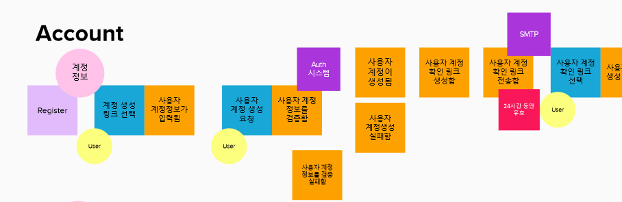

# 이벤트 스토밍

- 비즈니스 도메인 내에서 일어나는 것들을 찾아 bounded context를 식별하는 방법

### 도메인 이벤트 정의

- 과거형으로 기술
- 이벤트는 actor가 action을 해서 발생한 결과
- 생각나는 event 그냥 적기. 순서 상관 없음.
- 서로 중복되는 걸 없애거나 합치기
- 이벤트가 발생하는 시간 순서대로 붙임
  - 동시 수행되는 것은 수직으로 평행
- 이슈, 개선사항, 관심, 재논 사항은 빨간색으로 이벤트 옆에 붙임
- 비즈니스 용어로 적는 것. 시스템 내에 발생되는 것을 찾는 것이 아님

### 스토리 텔링

- 도출된 이벤트로 도메인의 업무 흐름을 이해하고 토론하여 보완

### 프로세스로 그룹핑

- 이벤트를 프로세스로 그룹핑
- 동일한 업무 프로세스로 이벤트를 그룹핑. 보라색에 프로세스명과 간략 설명 기술.
- 비즈니스 핵심 프로세스에 집중
- supporting 프로세스는 자세하게 이벤트 식별하지 않아도 됨

### 커맨드 정의

- 각 도메인 이벤트를 발생시키는 명령을 현재형으로 정의하며 명령형으로 기술
- 사용자의 행위가 command
- command는 일반적으로 무엇을 CRUD 요청한다 또는 무엇을 xx한다의 형태
  - 예시)
    - 자동 이체 계좌의 등록을 요청
    - 판매상품 목록 조회를 요청
    - 고객의 이메일 변경을 요청
    - 관심상품을 선택

### Trigger 정의

- command를 일으키는 actor와 event를 일으키는 external system, policy/rule 을 정의
- Actor는 하늘색으로 comnand와 겹쳐서
  - 구체적인 사용자 유형을 적기
- 이벤트 발생과 관련된 외부 시스템은 초록색. Event의 우측 상단에 겹쳐서 붙임
  - command의 요청을 받아 데이터만 제공해 주는 경우
  - 직접 무언가를 처리해서 결과 리턴하는 경우
  - 외부 시스템은 command 없이 event를 발생시킬 수 있음
    - 예제
      - 푸시알람 도착
  - 외부 시스템이란 현 시스템 밖에 있는 시스템. 회사 내부이거나 외부이거나
- 이벤트와 관련된 규정은 Event 우측 하단에 붙임. 보라색
  - 이벤트가 발생하기 위해 사전 체크할 정책, 규정
    - 예시
      - 이름, 이메일 필수 정보 등
  - 이벤트 발생 시에 정책, 규정
    - 예시
      - 주민번호 뒷자리는 마스킹 처리
  - 정책이나 규정은 event를 발생시킬 수 있음
    - 시간과 관련
    - 예시
      - 매월 말일에 1개월 내 만기되는 고객 리스트를 전 영업직원에게 메일로 통보하는 rule. 1개월 내 만기되는 고객 리스트가 통보되었다라는 event를 일으키는 trigger

### Aggregate 정의

- command 수행을 위해 CRUD해야 하는 데이터 객체 정의
- 고유의 비즈니스 목적 수행을 위한 데이터 객체들의 집합
- Entity와 VO의 집합
- 이 단계에서는 Entity까지 정의하고 다음 단계를 진행하는 것을 추천
- 규칙 (RPO)

  - Root only
    - aggregate root만 참조
    - aggregate 내부의 entity나 VO를 직접 접근하지 않고 root를 통해서 함
  - Primary key
    - 다른 Aggregate를 참조할 때 객체 자체를 레퍼런스하는 것이 아닌 객체의 pk로 참조
    - Order는 Consumer 객체 자체를 참조하지 않고, consumerId값으로 Consumer aggregate를 참조
  - One to one
    - 한 개의 트랜잭션은 한 개의 aggregate만 write
      - 동일한 서비스안의 RDBMS에서는 1:N이 될 수도 있음
      - 즉, 한개의 트랜잭션이 복수개의 Aggregate를 writing할 수 있음

- 예를 들면 피자주문DOMAIN의 Aggregate에는 Order, Consumer, Restaurant가 있습니다.
- Order Aggregate에는 Order, DeliveryInfo, PaymentInfo라는 Entity가 있고, Order
  Entity는 OrderLineItem(메뉴별 주문량)이라는 VO와 연결됩니다. Order와 OrderLineItem은 1:N의 관계가 됩니다.
- Command를 수행해서 Event를 발생시키려면 어떤 데이터(정보)가 필요한지 각 Command와 Event 사이의 위에 적음

- Entity 그룹핑
  - 어떤 데이터가 다른 데이터에 포함될 수 있으면 한 데이터로 묶음
    - "배송지주소"는 "주문자정보"에 묶일 수 있고, "결재방식종류"는 "결제수단정보"에 묶일 수 있음
  - 유사한 목적의 데이터로 하나로 묶음

### Bounded Context 정의

- entity, command, event, actor, policy/rule을 참고하여 어떤 주제와 관련있는지 논의
- bounded context는 사용자, 프로세스, 정책, 규정 등을 고유한 비즈니스 목적별로 그룹핑
- 주제별로 경계선 구분
- bounded context는 분홍색

### context map 작성

- bounded context 간의 관계를 도식화
- bounded context를 마이크로 서비스로 생각하면 쉬움
- 동기, 비동기를 구분해보기
  - 동기는 실선
  - 비동기는 점선

## 예제

